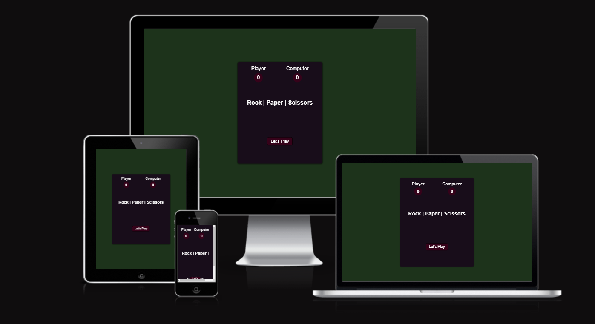

# rockPaperScissorsGame

Rock, Paper Scissors is a simple game with a totally random outcome. Playing this game in the digital version gives you a fairer outcome.
The game consists of one section where outcomes, results and selections are located.

A live version of the project can be found here - https://ancelottidev.github.io/rockPaperScissorsGame/

## Features

 #### Intro

  - The intro at the top contains the player's and the computer's current score.
  - In the central part there is a title that gives the user a clear name of the game.
  - In the lower part there is a button that starts the game.

  

  #### The Game Options

  - The options you can choose are of course: rock, paper and scissors.
  - Each selection has a separate button that is interactive and when you click it you start the game.

  

  #### The Game Result

  - When the user clicks on the selected option, javascript generates a random computer selection and compares the two sides.
  - The outcome is crystal clear to the user so the game looks very clean.

  

  #### Score Board

  - Score board contains the results of how many times the user won and how many times the computer won.
  - Score board is interactive, so the result is updated automatically.

  

  #### Testing

  - I tested playing this game in: Chrome, Safari and Firefox.
  - Game results are always correct.
  - I comfirmed that the color and fonts are easy to read and accessible by running it through lighthouse in devtools.

  

  #### Validator Testings

  - No errors were returned when passing through the official W3C validator.
  - No error were found when passing through the official (Jigsaw) validator.

  #### Unfixed bugs

  - No unfixed bugs.

  #### Deployment

  - The site was deployed to gitHub pages. The steps to deploy are as follows:
    - in the GitHub repository, navigate to the Settings tab.
    - From the source section drop-down menu, select the Master Branch.
    - Once the master branch has been selected, the page provided the link to the completed website.
  
  - The live link can be found here: https://ancelottidev.github.io/rockPaperScissorsGame/

  #### Media

  - The icons for rock, paper and scissors are taken from: https://www.flaticon.com/.

  #### Content

  - The content was inpired from Portfolio Project Scope.